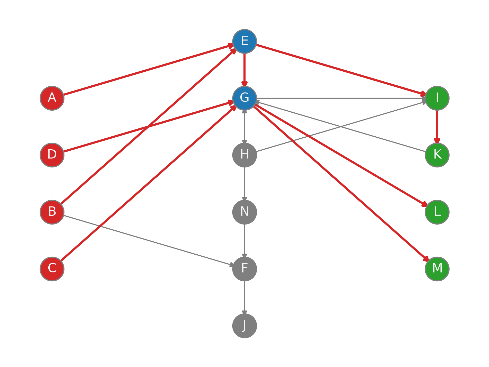

# BowTieBuilder-Algorithm
This repository contains a python implementation of the [BowTieBuilder Algorithm](https://doi.org/10.1186/1752-0509-3-67).

## Installation

The recommended python version is at [./.python-version](./.python-version), which is currently 3.13. All required dependencies are available at `pyproject.toml`.

## Usage
Implemented into the Signaling Pathway Reconstruction Streamliner [(SPRAS)](https://github.com/Reed-CompBio/spras).

Command Line Test:
```
python btb.py --edges ./input/edges.txt --sources ./input/source.txt --targets ./input/target.txt --output ./output/output.txt
```

The sources and targets file is a newline-delimited list of sources and targets present in the edges,
and the edges file is a tab-delimited three column (the last column, weight, between 0.0 and 1.0, is optional) file representing a directed interactome.

This outputs a directed subnetwork of the original input `edges` interactome.

Example Output:


(This was generated using [./vis.ipynb](./vis.ipynb) - see its instructions on how to reproduce this figure.)

## Original Paper

The original paper for BowTieBuilder can be accessed here:

Supper, J., Spangenberg, L., Planatscher, H. et al. BowTieBuilder: modeling signal transduction pathways. BMC Syst Biol 3, 67 (2009). https://doi.org/10.1186/1752-0509-3-67

## BowTieBuilder Docker image

Available on [DockerHub](https://hub.docker.com/repository/docker/reedcompbio/bowtiebuilder).

A simple pathway reconstruction algorithm that attempts to join sources and targets into a BowTie shape. The algorithm takes a network and 2 lists of nodes (source and target sets) as input. It outputs all edges in the network that are on the shortest paths from source to target sets.
